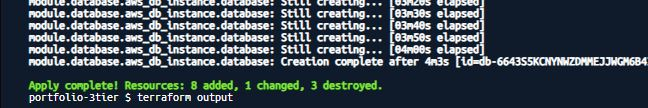
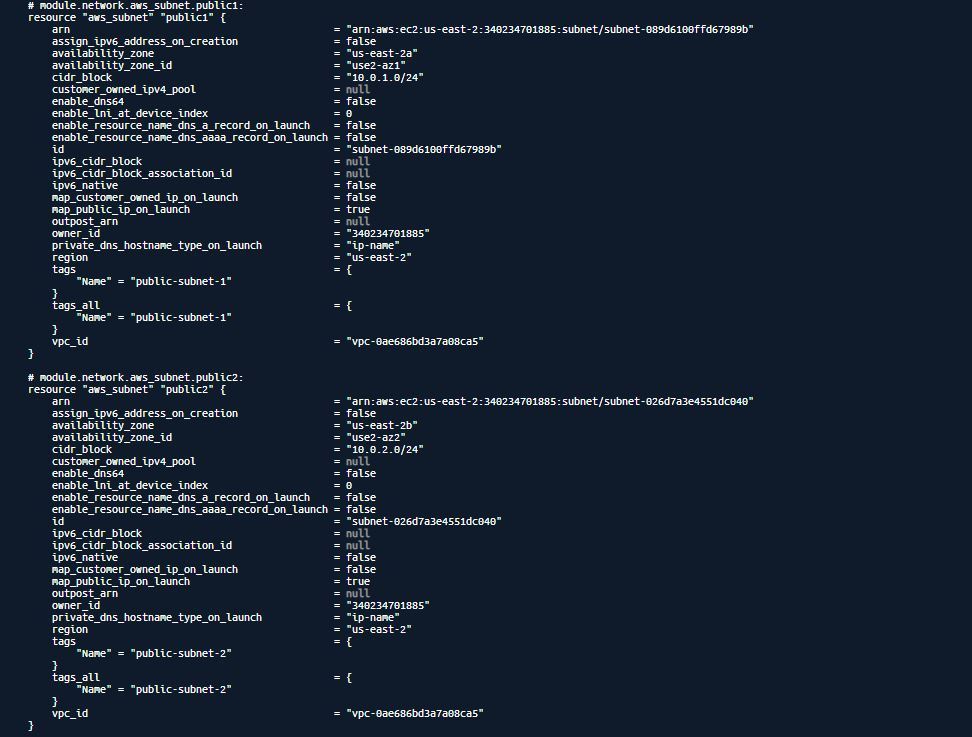
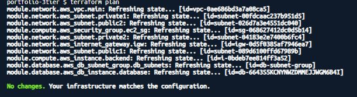

# AWS 3-Tier Architecture — Deployed with Terraform

This project demonstrates practicing beginner-level skills by deploying a secure, scalable **3-tier architecture** on AWS using **Terraform**.  
It includes Networking (VPC, Subnets), Compute (EC2), and Database (RDS) resources — all deployed as Infrastructure-as-Code (IaC).

---

## Project Overview

| Layer    | Services Used                       | Purpose                                   |
|----------|--------------------------------------|-------------------------------------------|
| Network  | VPC, Public & Private Subnets, IGW, NAT | Provides secure and isolated networking  |
| Compute  | EC2, Security Groups                | Hosts the web or application tier         |
| Database | Amazon RDS (MySQL/Postgres)         | Stores application data in a private subnet |

---

## Project Structure

```bash
portfolio-3tier/
├── README.md
├── main.tf
├── provider.tf
├── modules/
│   ├── network/
│   ├── compute/
│   └── database/
├── screenshots/
│   ├── terraform-apply.png
│   ├── aws-subnets.png
│   ├── no-changes.png


### Terraform Apply


### Terraform Apply


### AWS Subnets


### No Changes (Terraform Plan)



# 1. Initialize Terraform
terraform init

# 2. Validate configuration
terraform validate

# 3. See what will be created
terraform plan

# 4. Deploy resources
terraform apply -auto-approve

# 5. Inspect resources
terraform state list
terraform show

# 6. Destroy resources
terraform destroy -auto-approve


Key Learnings

Practiced Infrastructure-as-Code (IaC) using Terraform

Understood modular design for network, compute, and database layers

Learned how to separate public and private subnets for better security


Notes

The .tfstate file should never be committed to version control.

Future improvements could include:

Adding a Load Balancer (ALB) for high availability

Adding a NAT Gateway so private instances can reach the internet for updates

Multi-AZ RDS for improved durability
# 1. Initialize Terraform
terraform init


